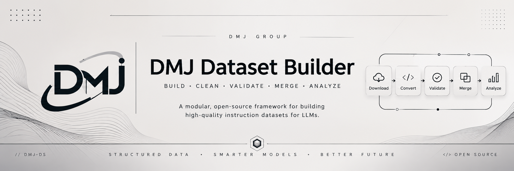

<p align="center">
  
</p>

<h1 align="center">DMJ Dataset Builder</h1>

<p align="center">
A modular, open-source dataset engineering framework for preparing high-quality instruction-tuning datasets for Large Language Models (LLMs).
</p>

<p align="center">


</p>

---

# 📖 Overview

DMJ Dataset Builder is an open-source framework that automates the preparation of datasets for instruction-tuned Large Language Models.

Instead of manually converting datasets one by one, the framework provides a modular pipeline capable of downloading, converting, enriching, validating, analyzing, and merging datasets into a unified training format.

---

# ✨ Features

- 📥 Dataset Downloader
- 🔄 Dataset Converter
- 🧩 Importer Registry
- 🏷 Metadata Enrichment
- 🆔 Version-aware Dataset IDs
- 📊 Statistics Engine
- ✅ Validation Engine
- 🔀 Dataset Merger
- ⚙ Configuration System
- 🖥 Command Line Interface
- 📁 Modular Architecture

---

# 🏗 Pipeline

```text
                Raw Dataset
                     │
                     ▼
             Dataset Downloader
                     │
                     ▼
             Importer Registry
                     │
                     ▼
            Dataset Converter
                     │
                     ▼
           Metadata Enrichment
                     │
                     ▼
             Validation Engine
                     │
                     ▼
             Statistics Engine
                     │
                     ▼
               Dataset Merger
                     │
                     ▼
          Final Training Dataset
```

---

# 📂 Project Structure

```text
DMJ-Dataset-Builder/
│
├── .github/
│   ├── workflows/
│   └── ISSUE_TEMPLATE/
│
├── assets/
│
├── configs/
│
├── core/
│
├── datasets/
│   ├── raw/
│   ├── processed/
│   └── final/
│
├── docs/
├── importers/
├── registry/
├── reports/
├── scripts/
├── templates/
├── tests/
├── utils/
│
├── build.py
├── README.md
├── CHANGELOG.md
├── CONTRIBUTING.md
├── CODE_OF_CONDUCT.md
├── SECURITY.md
├── LICENSE
└── requirements.txt
```

---

# 🚀 Installation

Clone the repository

```bash
git clone https://github.com/jadhavdurvesh/DMJ-Dataset-Builder.git

cd DMJ-Dataset-Builder
```

Create a virtual environment

```bash
python -m venv .venv
```

Activate it

Linux/macOS

```bash
source .venv/bin/activate
```

Windows

```powershell
.venv\Scripts\activate
```

Install dependencies

```bash
pip install -r requirements.txt
```

---

# 🖥 CLI

Download datasets

```bash
python build.py download
```

Convert datasets

```bash
python build.py convert
```

Validate

```bash
python build.py validate
```

Generate statistics

```bash
python build.py stats
```

Merge processed datasets

```bash
python build.py merge
```

---

# 📊 Output Format

Each processed record follows a common schema.

```json
{
  "id": "DMJ-DS-1.0.0-00000001",
  "instruction": "...",
  "input": "",
  "output": "...",
  "metadata": {
    "language": "python",
    "category": "Programming",
    "topic": "Arrays",
    "difficulty": "Intermediate",
    "estimated_tokens": 261,
    "has_code": true,
    "source": "Magicoder-OSS-Instruct-75K"
  }
}
```

---

# 📌 Current Capabilities

- Automatic dataset conversion
- Metadata enrichment
- Dataset validation
- Dataset statistics
- Duplicate-aware merging
- Version-aware identifiers
- Configurable pipeline

---

# 🛣 Roadmap

## v0.1.0

- Dataset Downloader
- Converter
- Metadata Enrichment
- Validation
- Statistics
- Merge Engine
- CLI

## v0.2.0

- Additional dataset importers
- Better topic classification
- Improved duplicate detection
- Enhanced reporting
- Plugin support

## v1.0.0

- Stable API
- Documentation importers
- Production-ready release
- Extended testing
- Complete documentation

---

# 🤝 Contributing

Contributions are welcome.

Please read:

- CONTRIBUTING.md
- CODE_OF_CONDUCT.md

before opening a Pull Request.

---

# 📜 License

Released under the MIT License.

---

<div align="center">

Built with ❤️ for the open-source AI community.

</div>